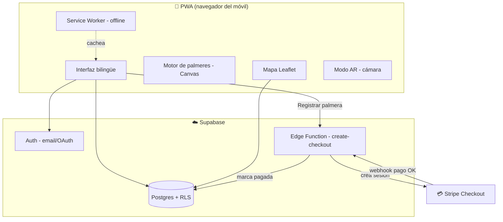

# PalmAR — Plan y Arquitectura

> **PalmAR** · *Encén la teua palmera en el cel d'Elx*
> App PWA para localizar, registrar y revivir en realidad aumentada las **palmeres** de la **Nit de l'Albà** de Elche.

---

## 1. Concepto

La **Nit de l'Albà** (noche del 13 al 14 de agosto, víspera de la Asunción) llena el cielo de Elche de miles de **palmeres**: cohetes que estallan en lo alto y dejan caer una cascada de luz dorada con forma de palmera, en honor al Palmeral (Patrimonio de la Humanidad). La noche culmina con la gran **Palmera de la Mare de Déu**, lanzada desde la Basílica de Santa María.

**PalmAR** convierte esa tradición en una experiencia digital:

- **Nombre**: *PalmAR* = **Palm**eral + **AR** (realidad aumentada). Se lee como "palmar".
- **Idea fuerza**: cada familia puede **apadrinar su propia palmera** en el cielo virtual de Elche, situarla en el mapa, ponerle una **nota familiar**, elegir su animación y **reconocerla** la noche de l'Albà apuntando con la cámara.
- **Doble capa**: una capa **pública y gratuita** (ver todas las palmeres, sin registro) y una capa **premium de pago** (registrar la tuya, personalizarla, comentar).

---

## 2. Funcionalidades

### Capa pública (gratis, sin login)

- Mapa de Elche con **todas las palmeres** registradas, incluidas las **oficiales del Ayuntamiento**
  (lugares y horas reales, marcador ★): Basílica de Santa María (*Palmera de la Mare de Déu*, 00:00),
  Glorieta, Pont del Bimil·lenari, Parc Municipal, Pont Nou…
- Ficha de cada palmera: tipo, hora, nota, **descripción**, **dedicatoria**, **galería de fotos/vídeos**
  y comentarios.
- **Simulación** a pantalla completa con la **silueta de la Basílica de Santa María** en sombra.
- **Modo AR**: cámara al cielo + **brújula GPS/giroscopio** que orienta con una flecha hacia la palmera
  más cercana (distancia + "la tens davant"). Sin cámara → cielo estrellado.
- **Compartir** cualquier palmera en redes (WhatsApp · Instagram · Facebook · X) con **enlace directo**
  (deep-link) que la abre en el mapa.
- Cuenta atrás para la próxima Nit de l'Albà.
- Selector de idioma **castellano / valencià**.

### Capa de usuario (login + pago único)

- **Cuentas** bajo correo electrónico: registro, login, logout, **recuperación de contraseña** por correo.
- **Perfil individual**: avatar (foto subible o inicial), nombre editable, correo, contador de palmeres,
  gestión de *Les meues palmeres* (compartir/editar/eliminar) y cierre de sesión.
- **Registrar tu palmera** (asistente de 3 pasos): **tipo** en un carrusel animado, **ubicación** en el
  mapa, **hora de encendido**, **nota / descripción / dedicatoria** y **fotos/vídeos**.
- **Pago** mediante Stripe (Checkout) antes de publicarla.
- **Simulación personalizada** sobre el plano de Elche tras el alta.
- **Interacción social**: comentar (con **avatar** del autor) y reaccionar a las palmeres de otras familias.

---

## 3. Stack tecnológico

| Capa | Tecnología | Por qué |
|------|------------|---------|
| Frontend | **PWA** (HTML5 + CSS + JavaScript vanilla, sin framework) | Ligera, instalable, offline, sin build. Fácil de mantener y desplegar. |
| Mapa | **Leaflet** + OpenStreetMap | Gratuito, sin API key, ideal para Elche. |
| Animaciones | **Canvas 2D** (motor de partículas propio) | Palmeres auténticas y fluidas en móvil. |
| AR | **WebRTC** `getUserMedia` + Canvas overlay + `DeviceOrientation` | AR sin app nativa, funciona en el navegador del móvil. |
| Auth + datos | **Supabase** (Postgres + Auth + RLS) | Backend gestionado, login real, datos compartidos, fila por seguridad. |
| Pago | **Stripe Checkout** vía **Supabase Edge Function** | Cobro seguro (la clave secreta nunca toca el cliente). Modo test para desarrollo. |
| Hosting | Vercel / Netlify / Cloudflare Pages | HTTPS gratuito (obligatorio para PWA, cámara y pago). |

> **Por qué sin framework**: una PWA estática es trivial de desplegar en cualquier CDN, arranca al instante, y el código es 100% legible y portable. Si más adelante crece, se puede migrar a React/Svelte sin rehacer el backend.

---

## 4. Arquitectura



**Flujo resumido**: el cliente lee palmeres directamente de Postgres (con políticas RLS que permiten lectura pública). Para registrar una palmera de pago, el cliente llama a una Edge Function que crea la sesión de Stripe; tras el pago, un webhook confirma y publica la palmera.

---

## 5. Modelo de datos (Supabase / Postgres)

| Tabla | Campos clave | Acceso |
|-------|--------------|--------|
| `profiles` | `id` (=auth.uid), `display_name`, **`avatar_url`**, `lang` | Dueño |
| `palmeras` | `id`, `owner_id`, `owner_name`, `name`, `family_note`, **`description`**, **`dedication`**, **`media`** (jsonb), `firework_type`, `lat`, `lng`, `ignite_at`, `color`, **`is_official`**, `is_paid`, `created_at` | **Lectura pública** · escritura dueño |
| `comments` | `id`, `palmera_id`, `author_id`, `author_name`, **`author_avatar`**, `body`, `created_at` | **Lectura pública** · escritura autenticada |
| `reactions` | `id`, `palmera_id`, `user_id`, `emoji` | **Lectura pública** · escritura autenticada |
| `orders` | `id`, `user_id`, `palmera_id`, `stripe_session_id`, `status`, `amount` | Dueño + Edge Function |

- **`media`** = array `[{ type:'image'|'video', url }]`. Imágenes comprimidas en cliente a JPEG ≤1280px;
  vídeos ≤3 MB; avatar a 256px. Hoy se guardan como **data URLs**; migrar a **Supabase Storage** para
  producción a escala (mejora futura).
- **`is_official`** marca las palmeres del Ayuntamiento (marcador ★, no editables por usuarios).

La SQL completa con `CREATE TABLE`, `ALTER TABLE ... ADD COLUMN IF NOT EXISTS` (idempotente), políticas
**RLS** y datos de ejemplo está en `supabase/schema.sql`. En modo demo se replica en `localStorage`.

---

## 6. Flujos de usuario

**A. Visitante (gratis)**
Abre la app → ve el mapa de Elche con palmeres → toca una → ve ficha, galería, descripción, dedicatoria y comentarios → pulsa *Simular*, *Modo AR* o *Compartir* → disfruta. Sin registro.

**B. Cuenta y perfil**
*Entrar* → registro/login con correo (o *Has oblidat la contrasenya?* → recuperación por correo). Al
entrar, el botón superior abre **el perfil**: avatar editable (foto o inicial), nombre, correo, contador,
*Les meues palmeres* y cerrar sesión.

**C. Registrar palmera**
Perfil/hero → *Apadrina la teua palmera* → elige tipo en el **carrusel** → marca ubicación en el mapa →
fija **hora**, **nota/descripción/dedicatoria** y **sube fotos/vídeos** → **pago Stripe** (o simulado) →
al confirmar, se publica y se lanza la **simulación** sobre el plano.

**D. Compartir**
Botón *Compartir* (ficha) o ↗ (*Les meues palmeres*) → API nativa del móvil o panel con WhatsApp /
Instagram / Facebook / X + **copiar enlace**. El enlace `?palmera=ID` abre esa palmera en el mapa.

**E. Modo AR**
*Modo AR* → permisos de cámara y GPS → apunta al cielo → toca para lanzar palmeres. El **giroscopio**
ancla la escena y la **brújula** dibuja una flecha hacia la palmera más cercana con su distancia; se pone
verde al alinearte. Sin cámara, fondo de cielo estrellado; sin GPS, cielo libre.

---

## 7. Pago (Stripe, modo test)

1. Cliente pulsa *Pagar y publicar*.
2. Llama a la Edge Function `create-checkout` (lleva `palmera_id` y el JWT de Supabase).
3. La función crea una **Checkout Session** con la clave **secreta** de Stripe (solo en el servidor) y devuelve la URL.
4. El cliente redirige a Stripe; en modo test se usa la tarjeta `4242 4242 4242 4242`.
5. Stripe llama al **webhook** → la función marca `orders.status = 'paid'` y `palmeras.is_paid = true`.
6. El cliente vuelve a la app y ve su palmera publicada.

> **Demo sin claves**: si no hay claves de Stripe configuradas, la app usa una **pasarela simulada** que imita el flujo (tarjeta de prueba, confirmación) para poder enseñarla al instante.

---

## 8. PWA y offline

- `manifest.webmanifest`: nombre, iconos, `display: standalone`, color de tema nocturno → **instalable** en la pantalla de inicio.
- `sw.js`: cachea el *app-shell* (HTML, CSS, JS, Leaflet) con estrategia *cache-first*; los datos van *network-first*.
- Funciona **offline** para ver la última versión cacheada y las animaciones.

---

## 9. Estructura de archivos

```
palmar-nit-alba/
├── PLAN-Y-ARQUITECTURA.md      ← este documento
├── README.md                   ← puesta en marcha y guía completa
├── CHANGELOG.md                ← historial de versiones
├── index.html                  ← app principal (assets versionados ?v=N)
├── manifest.webmanifest
├── sw.js                       ← service worker (offline, cache palmar-vN)
├── css/
│   └── styles.css              ← diseño nocturno
├── js/
│   ├── config.js               ← claves Supabase + Stripe (placeholders)
│   ├── i18n.js                 ← textos castellano/valencià
│   ├── fireworks.js            ← motor de palmeres (canvas) + silueta Basílica + sonido
│   ├── map.js                  ← mapa Leaflet + marcadores + selector de ubicación
│   ├── ar.js                   ← modo AR: cámara + brújula GPS/giroscopio
│   ├── data.js                 ← capa de datos (Supabase | local) + seed + generador de infografías
│   ├── payments.js             ← Stripe + fallback simulado
│   └── app.js                  ← orquestación / UI (perfil, alta, compartir, comentarios…)
├── icons/                      ← iconos PWA (192, 512, maskable)
└── supabase/
    ├── schema.sql              ← tablas + RLS + ejemplos (idempotente)
    └── functions/
        ├── create-checkout/
        │   └── index.ts        ← Edge Function: crea la sesión de Stripe
        └── stripe-webhook/
            └── index.ts        ← Edge Function: confirma el pago y publica
```

---

## 10. Roadmap por fases

| Fase | Entregable | Estado |
|------|-----------|--------|
| **0 — Prototipo** | PWA funcional con datos locales + pago simulado | ✅ Hecho |
| **0+ — Funcionalidad ampliada** | Perfil + avatar, recuperación de contraseña, fotos/vídeos, descripción/dedicatoria, compartir en redes + deep-link, AR con brújula GPS, palmeres oficiales, silueta de la Basílica, comentarios con avatar | ✅ Hecho |
| **1 — Backend real** | Conectar Supabase (auth + datos compartidos) | Código listo: claves en `config.js` + `schema.sql` |
| **2 — Pago real** | Stripe modo test con Edge Functions (checkout + webhook) | Código listo, requiere cuenta Stripe |
| **3 — Producción** | Dominio, HTTPS, modo live de Stripe, medios en Supabase Storage, RGPD | Pendiente |
| **4 — Crecimiento** | Notificaciones push la noche de l'Albà, ranking, fotos reales | Futuro |

---

## 11. Costes estimados (orientativos)

| Servicio | Plan inicial | Coste |
|----------|-------------|-------|
| Supabase | Free tier (hasta 50k usuarios auth, 500 MB DB) | **0 €** |
| Stripe | Sin cuota fija | ~**1,5% + 0,25 €** por transacción |
| Hosting (Vercel/Netlify) | Free / Hobby | **0 €** |
| Dominio `.es` | Anual | ~**10–15 €/año** |
| Mapa (OpenStreetMap) | — | **0 €** |

Arranque casi a coste cero; solo se paga comisión cuando alguien registra una palmera.

---

## 12. Consideraciones legales y de seguridad

- **Datos personales (RGPD)**: solo se guarda email y nombre visible; añadir política de privacidad y aviso de cookies antes de producción.
- **Pirotecnia real**: la app es **simbólica/digital**; no gestiona ni autoriza pirotecnia física. Conviene un descargo de responsabilidad.
- **Menores**: registro y pago solo para mayores de edad.
- **RLS de Supabase**: lectura pública de palmeres y comentarios; escritura solo del dueño/autenticado. Las claves **secretas** (Stripe) viven únicamente en la Edge Function.
- **Moderación**: prever reporte de comentarios para la capa social.

---

*Documento vivo — se actualizará a medida que avance el desarrollo.*
